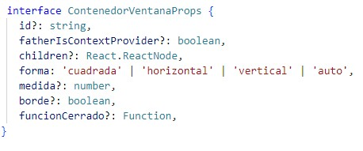
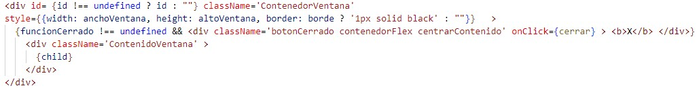

<!DOCTYPE html>
<html lang="es">

<head>
    <meta charset="UTF-8">
    <meta name="viewport" content="width=device-width, initial-scale=1.0">
</head>

<body>
    <hgroup>
        <h1>react-modal-responsive</h1>
        <h2>Propósito</h2>
    </hgroup>
    

        Se brinda una solución sencilla, robusta y extensible para el uso de ventanas y modales bajo el
        concepto de componente en React. Este componente facilita el proceso de desarrollo frontend al
        ofrecer al desarrollador la posibilidad de especificar la orientación y tamaño de una ventana o modal
        respecto
        al tamaño de la pantalla que visualiza el contenido o al componente que contiene la ventana o modal,
        su comportamiento (ejecución de cerrado y desmontaje del DOM) y la interoperabilidad de componentes
        anidados entre sí.
    

    <h2>Acerca del proyecto</h2>
    

        Este pequeño proyecto se realizó bajo la librería React, con el uso de Typescript, HTML y CSS.
        Su finalidad es presentar una solución reducida y flexible para la implementación de modales o ventanas;
        brindando una herramienta o ejemplo para aquellos que comienzan en el desarrollo web o buscan la forma
        de implementar el mismo tipo de componente para su uso personal o profesional.
    

    <h2>Estructura del proyecto</h2>
    

        Con el fin de ejemplificar los diferentes casos de uso en los cuales implementar el componente, se ha
        construido un proyecto piloto simulando un portal de acceso, área de visualización y detalle
        de productos.
    

    

        Su implementación se ha dividido en el siguiente grupo de carpetas, todas ellas contenidas en la
        carpeta <code>src</code>:
    

    <ul>
        <li>components</li>
        <li>data</li>
        <li>img</li>
        <li>pages</li>
        <li>routes</li>
        <li>styles</li>
    </ul>
    <h2>ContenedorVentana.tsx</h2>
    <small><code>react-modal-responsive/src/components/ventanas/VentanaDetalles.tsx</code></small> 
    <h3>Atributos</h3>
    

        ContenedorVentana es el componente principal, su función es brindar una opción responsive para la
        implementación de menus, modales y ventanas de información.  
        Cuenta con un conjunto de propiedades agrupadas en la interfaz <code>ContenedorVentanaProps</code>.
        La interfaz nos presenta los siguientes atributos:  
        <ul>
            <li>
                <b>id: </b> Asignamos un id al contenedor para diferenciarlo y conocer sus 
                dimensiones para futuros usos, como la creación de ventanas inscritas en el componente. 
            </li> 
            <li>
                <b>fatherIsContextProvider: </b> Confirmamos a la ventana en creación que su componente padre es
                otro ContenedorVentana, con la finalidad de consultar las dimensiones del componente padre y 
                renderizarse exitosamente dentro del mismo sin exceder las dimensiones del contenedor padre.
            </li> 
            <li>
                <b>children: </b>El atributo pertenece a la clase React.Reactnode, su función es permitir
                la ubicación de etiquetas o elementos e su interior, los cuales serían renderizador como 
                el contenido propio de la ventana.
            </li> 
            <li>
                <b>forma: </b>Define la relación de aspecto que debe tener la ventana; 'cuadrada' (relación 1:1),
                 'vertical' (relación 2 a 3), 'horizontal' (relación 3 a 2) y auto (Ideal cuando quieres que se 
                 adecúe a una cuadricula Grid de CSS)
            </li> 
            <li>
                <b>medida: </b>El porcentaje de la pantalla o del contenedor padre que quieres sea abarcado por 
                la ventana que estás declarando; su valor debe abarcar entre 1 y 100 y los valores de tamaño 
                serán definidos respecto al lado de mayor extensión correspondiente a su forma (si la forma es horizontal 
                el cálculo se hace respecto a la propiedad width, si la forma es vertical el cálculo se hace 
                respecto a la propiedad height). Si el atributo forma tiene el valor 'auto', este atributo no 
                será tenido en cuenta.
            </li> 
            <li>
                <b>borde: </b>Define si queremos que nuestra ventana se renderice con bordes.
            </li> 
            <li>
                <b>funcionCerrado: </b>Este atributo recibe la función que utilizará el componente padre para saber
                si debe dejar de renderizar la ventana (por lo general un llamado a un useState), adicionalmente 
                asigna un ícono de <b>X</b> en la parte superior derecha de la ventana. 
            </li>
        </ul> 
        

            
        

    

    <h3>Estructura</h3>
    

        La ventana puede ser diferenciada por 3 div principales, el primero se encarga de dar forma al contenedor
        por medio de las dimensiones especificadas en su atributo style y dividir su espacio en casillas grid, 
        además de ubicar el id en caso de que a dicho atributo se le dé un valor.  
        El siguiente div se renderizará de forma condicional, dependiendo de nuestra necesidad por contar con la 
        opción de cerrado.  
        Por último se presenta el div con className "ContenidoVentana", su función es posicionar el contenido 
        del atributo children en la parte central de la ventana.
    

    

        
    

    

        <i>En proceso de redacción y finalización -</i>
    

</body>
</html>
